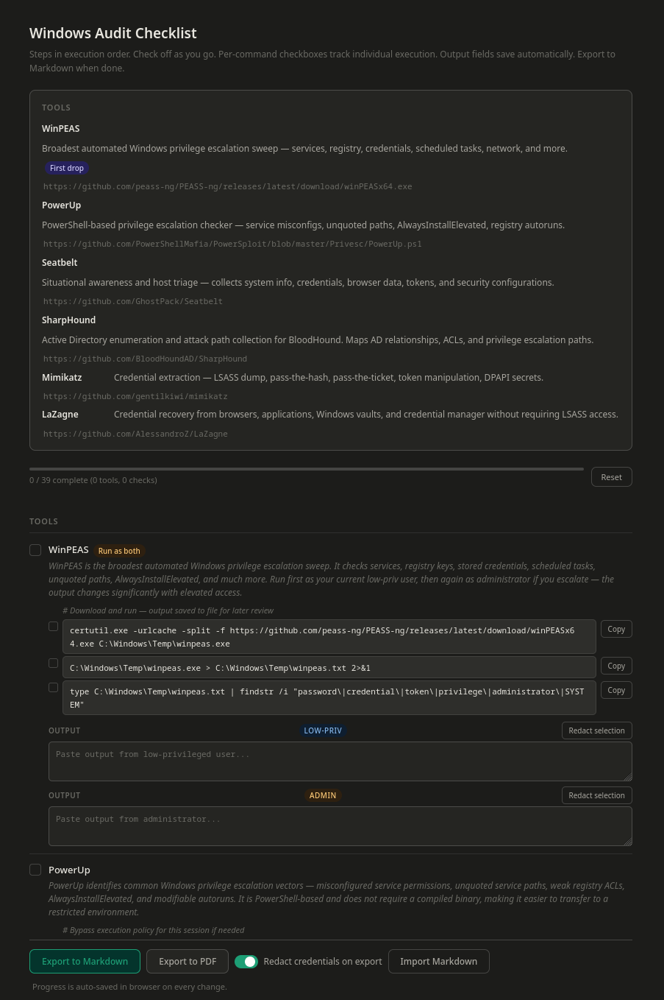

# Audit Checklists

A collection of self-contained, offline security audit checklists for penetration testers and red teamers. Each checklist covers a distinct target environment with ordered checks, ready-to-run commands, and built-in tooling support.



---

## Checklists

| Checklist | Target | Checks | Tools |
|---|---|---|---|
| [AWS](aws_audit_checklist.html) | Amazon Web Services environments | 9 | ScoutSuite, Pacu, enumerate-iam, cloudsplaining |
| [Azure](azure_audit_checklist.html) | Microsoft Azure cloud environments | 10 | ScoutSuite, ROADtools, AzureHound, PowerZure |
| [Docker](docker_audit_checklist.html) | Docker container environments | 34 | LinPEAS, DEEPCE, CDK, pspy, Lynis |
| [GCP](gcp_audit_checklist.html) | Google Cloud Platform environments | 8 | ScoutSuite, gcloud CLI, GCPBucketBrute |
| [Kubernetes](kubernetes_audit_checklist.html) | Kubernetes clusters | 9 | kube-hunter, Trivy, kube-bench, kubectl-who-can |
| [Linux](linux_audit_checklist.html) | Standalone Linux hosts | 12 | LinPEAS, pspy, Lynis |
| [macOS](macos_audit_checklist.html) | macOS endpoints and jump hosts | 10 | osquery, KnockKnock |
| [Windows](windows_audit_checklist.html) | Windows hosts and jump hosts | 33 | WinPEAS, PowerUp, Seatbelt, SharpHound, Mimikatz, LaZagne |

---

## Features

Every checklist in this repository is a single self-contained HTML file with no external dependencies. All features are shared across all checklists.

**Workflow**
- Ordered steps grouped by attack phase, each with a brief explanation of why the check matters
- Per-step access level badge — Low-priv, Root/Admin required, or Run as both
- Separate output fields for low-privileged and elevated runs where output genuinely differs
- Tool sections at the top with deployment commands and output capture alongside manual checks

**Tracking**
- Per-command checkboxes to track individual execution
- Checking the main step checkbox cascades to all sub-commands, and vice versa
- Progress bar covering both tools and manual checks

**Output & Reporting**
- All output fields auto-save to browser localStorage on every keystroke — nothing is lost on tab close or browser crash
- Credential redaction toggle — masks passwords, tokens, hashes, AWS keys, JWT tokens, and certificate blocks on export
- Manual redact selection — highlight any text in any output field and redact it in one click
- Export to Markdown — produces a structured `.md` report with all steps, commands, and output
- Export to PDF — prints the full checklist with all output field content correctly expanded
- Export filenames include the date and redaction state: `docker_audit_2026-03-01_redacted.md`
- Import Markdown — restores all checkboxes, per-command checkboxes, and output field content from a previously exported file

**Customisation**
- Additional checks section at the bottom of each checklist for engagement-specific steps
- Dark mode support

---

## Usage

Download the checklist HTML file for your target environment and open it in any modern browser.

```
git clone https://github.com/0xsyr0/audit-checklists
cd audit-checklists
open docker_audit_checklist.html
```

No build step, no dependencies, no server required. Each file is fully self-contained.

---

## Repository Structure

```
audit-checklists/
├── README.md
├── aws_audit_checklist.html
├── azure_audit_checklist.html
├── docker_audit_checklist.html
├── gcp_audit_checklist.html
├── kubernetes_audit_checklist.html
├── linux_audit_checklist.html
├── macos_audit_checklist.html
├── windows_audit_checklist.html
└── assets/
    └── preview.png
```

---

## Scope Notes

| Checklist | In Scope | Out of Scope |
|---|---|---|
| AWS | IAM privesc, S3, EC2 IMDS, Lambda, Secrets Manager, CloudTrail | AWS-native container orchestration |
| Azure | IAM, storage, Key Vault, IMDS, NSGs, conditional access | Azure DevOps, Intune |
| Docker | Container escape, socket abuse, namespace isolation, credential hunting inside containers | Kubernetes-specific workloads |
| GCP | IAM, GCS, GCE metadata, Cloud Functions, Secret Manager | GKE-specific checks (see Kubernetes) |
| Kubernetes | RBAC, service account abuse, pod escape, kubelet API, etcd, network policies | Cloud provider IAM integration |
| Linux | Standalone host privilege escalation, service enumeration, credential hunting | Container-specific checks (see Docker) |
| macOS | TCC bypass, persistence, Keychain access, SIP status | iOS / mobile |
| Windows | Local privilege escalation, AD enumeration, credential hunting, lateral movement prep | Domain controller compromise steps |

---

## Disclaimer

These checklists are intended for use by security professionals during authorised engagements only. All techniques documented here should only be executed against systems for which explicit written permission has been obtained. The authors accept no liability for unauthorised use.

---

## License

MIT
